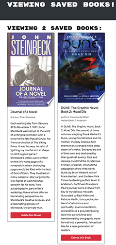

# Book-Search-Engine-MERN
Book search engine using MERN stack

UCLA Bootcamp Challenge  - Module 21

Due Date 1/24/2023

## Challenge Tasks

Provided a fully functioning RESTful API that uses Google Books API search engine and refactor it to be a GraphQL API built with Apollo Server. The app is built using the MERN stack with a React front end, MongoDB database, and Node.js/Express.js server and API. It's already set up to allow users to save book searches to the back end.

## Acceptance Criteria

- Set up an Apollo Server to use GraphQL queries and mutations to fetch and modify data, replacing the existing RESTful API.

- Modify the existing authentication middleware so that it works in the context of a GraphQL API.

- Create an Apollo Provider so that requests can communicate with an Apollo Server.

- Deploy your application to Heroku with a MongoDB database using MongoDB Atlas

- The following 2 images show the home page and the logged user's saved book page: 

## Deployment and Github

Book Search application is deployed on [Heroku](https://secure-brook-72522.herokuapp.com)

ReRepository for Book Search application can be found at: [GitHub](https://github.com/Me-ross/Book-Search-Engine-MERN)
